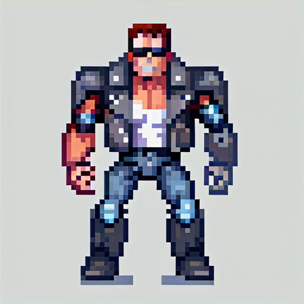

  

<h2 align="center">- Hasta La Vista, Pilot -</h2>

---

## 🧠 Project Title: NLP-Based Drone Control in Mixed Reality

This project enables real-time drone navigation using natural language commands, leveraging a combination of NLP, object detection, SLAM, and mixed reality technologies.

---

## 🎯 Objective

To build an intelligent system where a drone receives spoken commands like:

> “Go to the chair”

...and autonomously interprets the environment, identifies the target, calculates the 3D position, and navigates toward it.

---

## 🧩 System Components

### 🔊 Natural Language Processing (NLP)
- Converts voice input into structured commands.
- Extracts **intent** (e.g., `go`) and **target object** (e.g., `chair`).
- Uses a lightweight LLM or prompt-based classifier.
  
### 🎥 Mixed Reality + Vision
-   MR headset streams stereo video to the processing system.
-   YOLOv8 or equivalent detects objects (chair, table, etc.).
-   Depth sensors (e.g., RealSense, Azure Kinect) or stereo matching provide 3D location of the object.
-   Optional: MR overlays can provide user feedback or path previews.

### 📍 SLAM Integration
-   RTAB-Map or OpenVSLAM generates real-time environment mapping.
-   Used to localize the drone and compute target location in 3D space.
-   Enables dynamic obstacle avoidance and environment awareness.

### 🚁 Drone Control (Robotics)
-   Computes trajectory using PID control or trajectory planning.
-   Issues acceleration or velocity commands based on drone API.
-   Optionally uses Arduino or microcontroller for low-level motor control.
